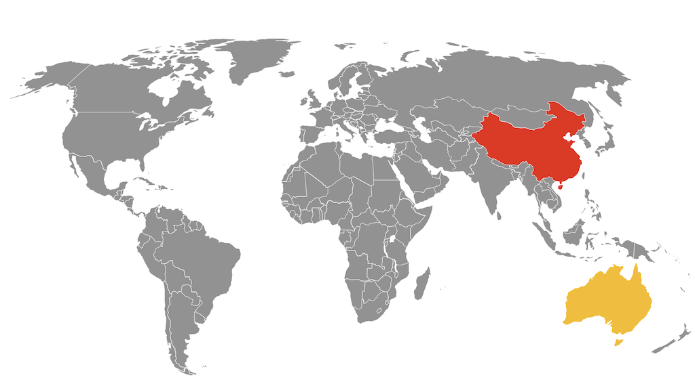
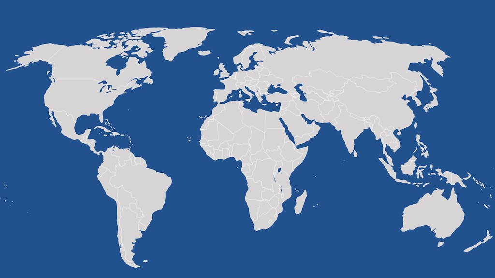

# Keynote World Map

Editable world map – can colour individual countries, change borders etc. – in Apple Keynote format

## Examples

## Usage

### Colouring Individual Countries

- Double click on relevant country and choose a colour!

### Changing Border Between Countries

- Ungroup counties (should select all by default)
- Change border properties
- Regroup countries

## Notes

Some borders are thicker than they should be, but it's an improvement on the $20 template I bought from one site where half of Russia couldn't be coloured!

I'll try recreating the maps from another dataset when I find time.

## Creation Process

- Install EazyDraw (http://www.eazydraw.com) from AppStore
- Import SVG
- Export as Keynote
- Open generated slide in Keynote (Keynote should offer to upgrade the slides to a newer version)

## License

Created from MIT Licensed SVG map (c) 2015 Pareto Software, LLC DBA simplemaps.com

Keynote variation MIT Licensed (c) 2019 Andy Davies
